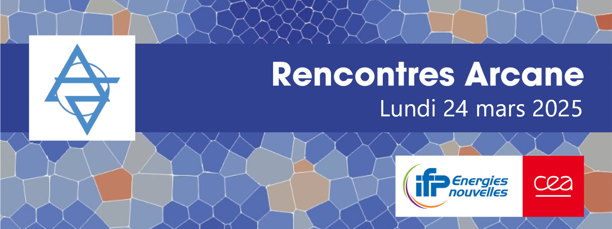

# Events

This repository store documents/presentations of Arcane events (i.e. Rencontres Arcane)

## Next event is 'Rencontres Arcane' on 24th mars 2025

The next session of 'Rencontres Arcane' are scheduled on March 24th 2025 at [TGCC](https://www-hpc.cea.fr/en/TGCC.html).

-- |  Programme de la journée
-- |  --
09h00 | **Acceuil des participants**
09h30 | <ul><li>[Arcane] Présentation nouveautés maillage 20mins (AMR , maillages polyédriques et raffinement par subdivision)<li>[Arcane] Partie GPU 20mins </li><li>[Arcane] Didacticiel utilisation Arcane 20mins</li></ul>
10h30 | Pause
11h00 | [CEA] 1: Utilisation de l’API Accélérateur Arcane pour le portage GPU du code Phénix, Simon Pomarède
11h30 | [IFPEN] 1: ArcNum, un framework numérique à base d’Arcane pour les applications de simulation en milieu poreux, Raphaël Gayno 
12h00 | Buffet
13h30 | [IFPEN] 2: Éléments Virtuels et méthodes volumes finis multipoints dans l’environnement Arcane – Application à des simulations multi-physiques de stockage de CO2, Guillaume Enchéry 
14h00 | [CEA] 2: Introduction d’un modèle de spray dans le code MaHyCo, Lucas Prouvost
14h30 | Pause
15h00 | [CEA] 3: ArcaneFEM: Scalable GPGPU Implicit FEM Solver for Unstructured Meshes, Mohd Afeef Badri
15h30 | [IFPEN] 3: Les Arcanes de la géoscience : une boite de pandore nommée ArcaDES, Benoît Chauveau 
16h00 | [Arcane] <ul><li>Présentation des fonctionnalités des dernières versions d'Arcane</li><li>Roadmap Arcane, Discussion</li></ul>
16h30 | Clôture de la journée 

