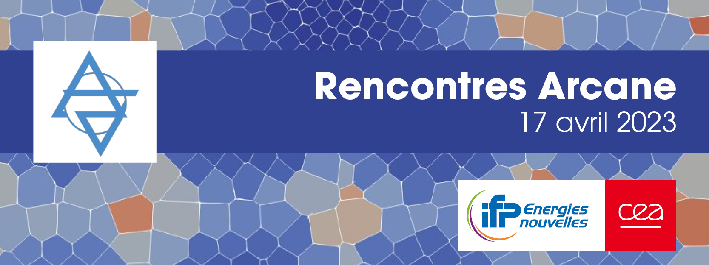

# Rencontres Arcane - 17 avril 2023

 -- |  Programme de la journée
 -- | --
 9h | Accueil des participants
 9h30 |  Maillage SLM3D pour la simulation des réservoirs fracturés en géothermie dans une application Arcane
 10h | Optimisation et parallélisation d'un algorithme de détection de contact : Potatoes
10h30 | Pause
10h45 | Inférence d'un réseau de neurones dans un code HPC : étude d'efficacité et présentation d'un use case dans le simulateur Arcane Geoxim
11h15 | Accélération et amélioration des simulations grâce au deep learning
11h45 | Visite
12h15 | Buffet
13h30 | Modélisation du couplage entre l’écoulement, la chimie et la géomécanique dans Geoxim
14h | Phénix : un code multi-physiques sous Arcane
14h30 | Introduction du coupleur preCICe dans le simulateur A2 - ArcTem/Code-Aster
15h | Pause
15h15 | Modèles utilisateurs dans Phénix: mise en place et exemple d'utilisations
15h45 | Raffinement statique de maillage cartésien dans Phénix
16h15 | Roadmap Arcane, un point sur l'Open Source et discussions
17h | Clôture de la journée
