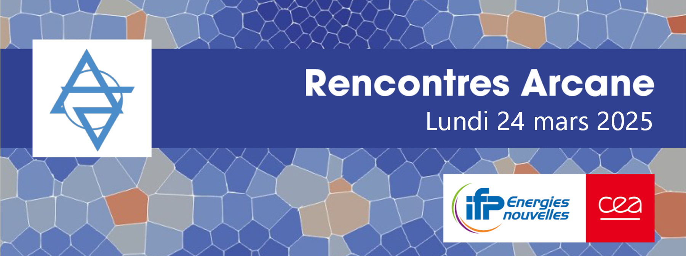

# Rencontres Arcane 2025

This repository store documents/presentations of Arcane events (i.e. Rencontres Arcane)

## Next event is 'Rencontres Arcane' on 24th mars 2025

La version 2025 des Rencontres Arcane a eu lieu au [TGCC](https://www-hpc.cea.fr/en/TGCC.html) le 24 mars 2025.

Liste des présentations:

- [Nouveautés Arcane](./presentations/RencontresArcane2025_00_Arcane_Features.pdf)
- [Didacticiel utilisation Arcane](./presentations/RencontresArcane2025_01_Arcane_Intro.pdf)
- [API accélérateur Arcane](./presentations/RencontresArcane2025_02_Arcane_GPU.pdf)
- [Utilisation de l’API Accélérateur Arcane pour le portage GPU du code Phénix, Simon Pomarède](./presentations/RencontresArcane2025_03_PhenixAPIAccelerateur.pdf)
- [ArcNum, un framework numérique à base d’Arcane pour les applications de simulation en milieu poreux, Raphaël Gayno](./presentations/RencontresArcane2025_04_ArcNum_Sharc.pdf)
- [Éléments Virtuels et méthodes volumes finis multipoints dans l’environnement Arcane – Application à des simulations multi-physiques de stockage de CO2, Guillaume Enchéry](./presentations/RencontresArcane2025_05_VEF_CO2.pdf)
- [Introduction d’un modèle de spray dans le code MaHyCo, Lucas Prouvost](./presentations/RencontresArcane2025_06_ModeleSprayMaHyCo.pdf)
- [ArcaneFEM: Scalable GPGPU Implicit FEM Solver for Unstructured Meshes, Mohd Afeef Badri](./presentations/RencontresArcane2025_07_ArcaneFEM.pdf)
- [Les Arcanes de la géoscience : une boite de pandore nommée ArcaDES, Benoît Chauveau](./presentations/RencontresArcane2025_08_ArcaDES.pdf)
- [Roadmap Arcane](./presentations/RencontresArcane2025_09_Arcane_Roadmap.pdf)

